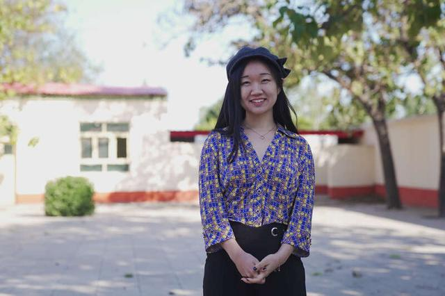

# 科技遇见他

## 分享你与科技的# HERstory

### 一小时编程挑战直播课

#### 等你来挑战

_联合国开发计划署_

_联合国妇女署_

_Coding Girls Club_

> 在联合国#平等一代#倡导活动的框架之下，联合国开发计划署与联合国妇女署共同发起#HERstory##科技遇见她#倡议活动，聚焦科技领域，开启故事征集，将许许多多个体的故事汇流成川，为广大有志进入科技领域的女性赋予信心。

出生于1991年的任晓媛，有丰富经历和很多“金光闪闪”的头衔。2018年，她被福布斯中国选为30位30岁以下科学家之一；同年，作为5名中国女性科学家之一加入由全球80名女性科学家组成的团队，参加了“家园归航计划”在南极为期3周的科学探索；2019年，她进入了英国广播公司BBC的“巾帼百名”名单。前不久，联合国环境规划署向任晓媛颁发了2020年“地球卫士青年奖”，以表彰她创建的公益团队MyH2O吾水信息平台在农村水资源保护与净化工作上的积极作为。全球共有7位30岁以下青年获得这一奖项，任晓媛是其中唯一的中国青年。

联合国环境规划署对这位心系农村社区饮水安全的北京姑娘有这样一段介绍：对中国大部分农村居民来说，能否喝上安全放心的饮用水仍是一件不确定的事情。据估计，中国50％以上的浅层地下水受到农业径流和工厂废水的污染，而全球每年有数百万人因污染水源患病。任晓媛对此十分了解。

作为一个致力于解决3亿农村居民饮用水安全问题的数据平台，在过去5年里，MyH2O一直在借助青年志愿者调研团队，绘制一张覆盖全国、如实反映农村饮用水质量的水质地图，进而通过上游有效的数据诊断，引导村民寻找干净水源，同时帮助一些具有明确水安全提升需求的农村社区，与当地政府部门和专门支持健康饮水的公司建立联系。自2018年开启区域专项以来，任晓媛已经带领团队帮助安徽六安、云南保山、甘肃甘谷、河北宁晋等地的7个乡村社区接入了附近的管网，安装了第三方捐赠的净水器或服务全村的水站，建立起了MyH2O长期农村水安全示范点。

但任晓媛觉得这还远远不够。年初暴发的新冠疫情，对支撑公益平台运转的企业和资金会资助造成了不小影响，一些项目点的后续跟进工作也被迫延后。“对于如何将解决方案精准落地，平台目前还在初期探索阶段。”任晓媛希望，未来两年净水设备落地项目能够至少覆盖40至50个村庄，同时组织更多专业人员对村民和孩子进行环保知识的普及，用一到三年时间的回访，评估实现由村民独立运营当地饮水站的发展模式，在“授人以鱼不如授人以渔”的过程中，让农村居民喝上安全的水。

  

