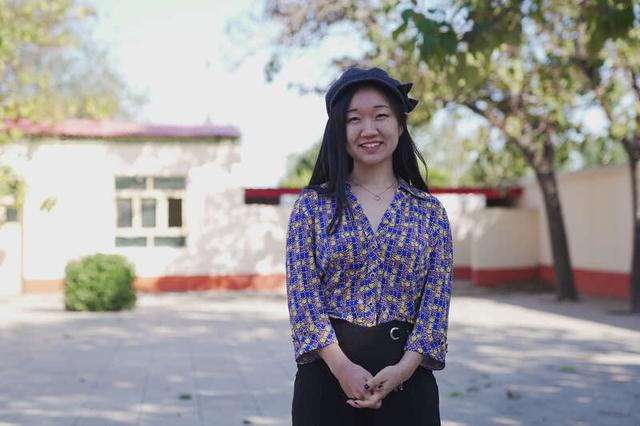
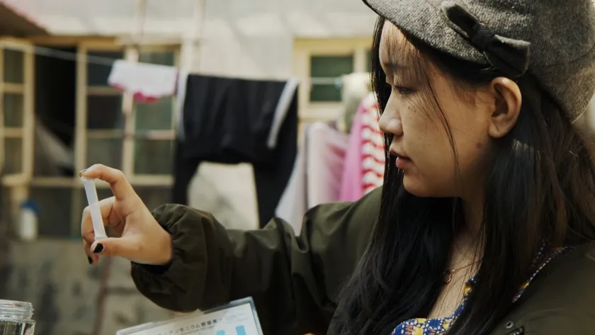

# 科技遇见她

## 分享你与科技的# HERstory

### 一小时编程挑战直播课

#### 等你来挑战

_联合国开发计划署_

_联合国妇女署_

_Coding Girls Club_

> 在联合国#平等一代#倡导活动的框架之下，联合国开发计划署与联合国妇女署共同发起#HERstory##科技遇见她#倡议活动，聚焦科技领域，开启故事征集，将许许多多个体的故事汇流成川，为广大有志进入科技领域的女性赋予信心。

##### 联合国环境规划署对这位心系农村社区饮水安全的北京姑娘有这样一段介绍：对中国大部分农村居民来说，能否喝上安全放心的饮用水仍是一件不确定的事情。据估计，中国50％以上的浅层地下水受到农业径流和工厂废水的污染，而全球每年有数百万人因污染水源患病。任晓媛对此十分了解。

##### 作为一个致力于解决3亿农村居民饮用水安全问题的数据平台，在过去5年里，MyH2O一直在借助青年志愿者调研团队，绘制一张覆盖全国、如实反映农村饮用水质量的水质地图，进而通过上游有效的数据诊断，引导村民寻找干净水源，同时帮助一些具有明确水安全提升需求的农村社区，与当地政府部门和专门支持健康饮水的公司建立联系。自2018年开启区域专项以来，任晓媛已经带领团队帮助安徽六安、云南保山、甘肃甘谷、河北宁晋等地的7个乡村社区接入了附近的管网，安装了第三方捐赠的净水器或服务全村的水站，建立起了MyH2O长期农村水安全示范点。

##### 但任晓媛觉得这还远远不够。年初暴发的新冠疫情，对支撑公益平台运转的企业和资金会资助造成了不小影响，一些项目点的后续跟进工作也被迫延后。“对于如何将解决方案精准落地，平台目前还在初期探索阶段。”任晓媛希望，未来两年净水设备落地项目能够至少覆盖40至50个村庄，同时组织更多专业人员对村民和孩子进行环保知识的普及，用一到三年时间的回访，评估实现由村民独立运营当地饮水站的发展模式，在“授人以鱼不如授人以渔”的过程中，让农村居民喝上安全的水。

##### 任晓媛还有一个更长远的十年计划。她认为，追着水污染源点对点地对接净水资源，并不能从源头上解决农村饮用水的安全问题。她希望能够以“吾水地图”上收集的信息数据为驱动，更深层次地挖掘和沉淀特定区域内有关饮水安全的规律性议题，从而推动区域性的饮水安全倡导和变革。任晓媛对中青报·中青网记者举例说，比如一个工业园区正在搬迁安置，附近的农村社区和居民可能并不了解面临的潜在环境风险，以及如何去规避一些伤害。“这是一种环境不平等。”任晓媛说，“我们希望通过慢慢积累摸索出一些规律和经验，最终能够在污染问题发生之前进行有效规避。”

##### 出生在北京、高中毕业后赴美留学的任晓媛，内心对农村地区深沉的关注和爱，最先源起于父母，她的父母都是从出身农村、一路打拼出来得以在北京立足的。小时候，她常会跟着父母回到农村。父母也常常告诉她，“农村是他们这个家庭的根基”；她自己也感觉“对农村没有陌生感”。这为她以后将农村和发展中社区确定为自己的实践领域埋下了伏笔。

##### 高中时期，她偶然地参与了一次学校组织的垃圾分类回收活动，当时对环保主题“还没什么概念”的任晓媛加入了北大附中“根与芽”社团，后来被推选为社团负责人。可以说这是一次改变任晓媛人生发展方向的社团实践经历。1994年进入中国的“根与芽”环境教育项目由英国知名动物学家珍·古道尔博士面向全球发起，旨在唤起公众在日常生活中与环境和谐相处的意识。任晓媛担任社团负责人期间，恰逢古道尔到北大附中交流，古道尔为了观察黑猩猩在野外生活38年的经历启发了任晓媛，“我开始逐渐意识到，人类与世界、与自然是密不可分的。”

##### 任晓媛回想起，一次社团活动聚餐中自己顺手拿起一次性筷子，因此被社团成员“谴责”。她意识到，那可能是环保种子在整个社团里年轻人内心扎根发芽，并逐渐让他们改变生活方式的开始。也就是从那时起，还是高中生的任晓媛已经确信，“环保和公益是自己要花一辈子去做的事情”。在美国瓦萨学院完成本科学业后，她又到麻省理工学院攻读了环境工程学硕士学位。不满足于仅仅待在实验室的她，借助学校搭建的项目平台，去印度研究水信息系统，去墨西哥湾观测洋流，正式开启了她与“水”的情缘。

##### 那之后不久，她在学校和国内社会组织支持下，远程发起成立了MyH2O平台，开始招募大学生志愿者团队到中国农村地区去调研水资源信息。MyH2O也同步确定了“吾水信息平台”的中文名字。“‘吾水’，顾名思义，‘我的水’。全球水生态都是紧密链接的，因而水是我们共同的资源，我们要一起维护共同分享的水。”任晓媛这样解释平台名字的含义。2017年，完成学业的任晓媛决定回国，全职负责MyH2O平台的运营，“我的根在这里”。

##### 目前，任晓媛跟另外四位全职成员，联同十几位志愿者，在北京构成了MyH2O的中枢团队，辐射中、英、美多个国家的数十个高校社群。创立至今，共有130多支高校团队和上千名项目志愿者成为MyH2O的合作伙伴，他们走访了全国24个省区，足迹遍布近千个村庄，收集了3800余份检测水样、7000余份健康与卫生调研问卷。2019年，MyH2O团队和志愿者根据对该年暑期调研结果的梳理，在新媒体端发表了一份反映中国农村水安全问题的可视化报告。报告显示，农村饮用水潜在污染源来自工业、农业、矿业、畜牧业、生活垃圾和废水等各个方面。类似的体系化数据分析，将构成任晓媛推进平台“十年计划”实施的基础。

##### 不知不觉中，那个懵懵懂懂踏入环保公益领域的小姑娘，成为了将环保种子播撒给其他人的赋能者。在MyH2O官网的项目介绍中，“人才培养计划”是平台在设计发展过程中很重要的一环。任晓媛介绍说，平台不仅建立了相应的人才培养与晋升机制，也设置了激励措施，对优秀成员进行表彰与公示，让更多有意愿的青年在水主题背景下获得持续化、专业化的成长。

##### 据记者了解，有学生在参与“吾水计划”后，回校创立了与保护水资源有关的社团，也有人在毕业后直接选择进入水质检测公司工作，这都让任晓媛备感欣慰、备受鼓舞，她说：“我愿意让更多年轻人相信，他们的努力将能够为社会带来可持续和有价值的改变，他们自己也可以更长久地活跃在社会创新和变革的体系之内，成为持续推动社会发展的核心力量。”不过她也想跟有意于投身环保公益事业的年轻伙伴们说，“在一些现实性问题面前，有时候要学会接受个体的无能为力，但请永远相信，我们能够通过不断学习找到一些有助于解决问题的方法。”

##### 此次获得联合国环境规划署颁发的“地球卫士青年奖”，让任晓媛感到开心的是，中国青年的专业度在国际舞台上得到了认可，她也认为这对她来说意味着一个新的开始。作为获奖者，任晓媛将获得联合国环境规划署提供的种子资金和导师指导。在更高境界上步入关乎地球命运的“决定性十年”，任晓媛说：“中国青年的实际行动，对促进解决全球环境问题将发挥更重要作用、具有更大意义。”
